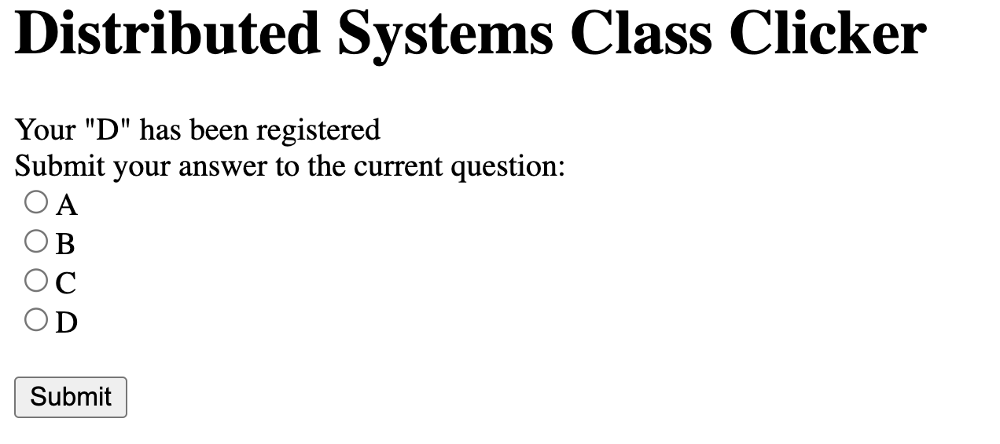
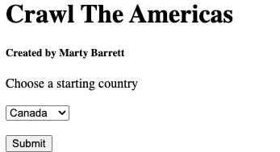
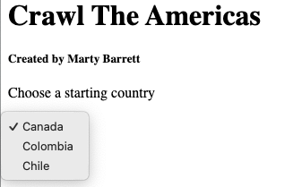
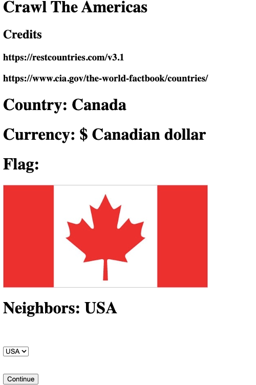
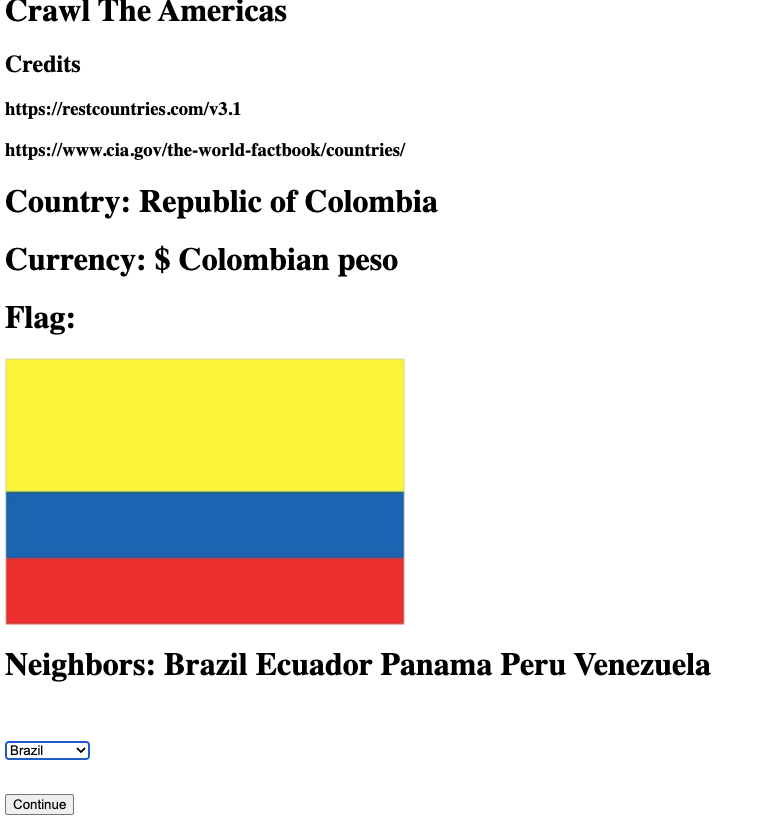

# 95-702 Distributed Systems
# Project 1
## Assigned: Monday, September 8
## Due: Monday, September 22, 2:00 PM
## Late by one minute is late!

This project has five objectives:

**First**, you are introduced to IntelliJ and TomEE. You already have some practice with these. In this assignment, you'll build several web apps to gain more experience.

**Second**, you build your first set of distributed systems. These are two small web applications using Servlets and Java Server Pages.

**Third**, you are introduced to web scraping, API processing, and JSON records.

**Fourth**, you are introduced to the MVC pattern if you have not used it before.

**Fifth**, as in all projects this semester, you should reflect on the functional and non-functional characteristics (e.g. security, scalability, failure handling, interoperability) of your solutions. There will be questions on the final exam concerning these characteristics. You should be able to demonstrate a nuanced comprehension of course content and be able to explain the technical aspects in relation to potential real-world applications. For each project task, software documentation is required. The software that you write (Java files and so on) must contain comments that describe what each significant piece of code is intended to accomplish. Points will be deducted if code is not well documented. Read the documentation-related links provided on the course schedule (for class #1) to understand what is expected. Be sure to consult the rubric for details on grading.

and **sixth**, **optionally** you may use ChatGPT and Copilot to create some of your code in Task 3. Task 1 and Task 2 **must** be done on your own. There will be exam questions that ask specifically about the code in all three tasks. While you are allowed to use AI tools to help with Task 3, it is totally optional. There will be questions about this code, too. Also pay attention to the more general issues like, what is MVC and what are the benefits of using it? What does it mean to scrape a web page?.

# Task 1
# Use the IntelliJ Project Name:  Project1Task1

Create an index.jsp page that asks the user to enter a string of text data, and to make a choice of two hash functions using radio buttons. The hash function choices should be MD5 and SHA-256, with MD5 being the default.  When the submit button is pressed a request is sent to a servlet. The servlet must be named ComputeHashes.java. The servlet will compute the requested cryptographic hash value (MD5 or SHA-256) from the text transmitted by the browser. You will need to employ the Java crypto API to compute the hash of the text. The original text will be echoed back to the browser along with the name of the hash, and the hash value. The hash values sent back to the browser should be displayed in two forms: as hexadecimal text and as base 64 notation. We will discuss the use of such hash values later in the course.  To compute the MD5 and SHA-256 hashes, use these standard java packages:

    import java.security.MessageDigest;
    import java.security.NoSuchAlgorithmException;

To print the Base64 encoding, use the following method:

    jakarta.xml.bind.DatatypeConverter.printBase64Binary()

To print the hexadecimal encoding, use the following method:

    jakarta.xml.bind.DatatypeConverter.printHexBinary()

To include the DatatypeConverter class into your project, use:

    import jakarta.xml.bind.DatatypeConverter;

and add these lines to your pom.xml file, then refresh Maven:

```
<dependency>
    <groupId>jakarta.xml.bind</groupId>
    <artifactId>jakarta.xml.bind-api</artifactId>
    <version>4.0.1</version>
</dependency>
```

Be sure to provide a simple and user friendly interface.  If you are unfamiliar with HTML forms, a simple explanation can be found at:

    http://www.w3schools.com/html/html_forms.asp

Because Task 1 is fairly simple, you do not have to use MVC for it. Do the simplest thing possible (however, feel free to use MVC if you'd like).

For grading purposes, please use the URL 
```
localhost:8080/compute-hash-servlet/?text=<string goes here>.
```

# Task 2
# Use the IntelliJ Project Name: Project1Task2

Create a web application that implements a simple desktop and mobile “clicker” for class.  Your app should allow users to submit answers to questions posed in class, and should provide a separate URL end point for getting the results of the submitted responses.  The welcome page for your app should be similar to Figure 1.  You can make it more stylish if you like, but it is not required.


***Figure 1***

When the user makes a choice and hits “submit”, their answer should be stored in your MVC model.  The response should be similar to The first line of Figure 2. Notice that it is **required** to provide feedback to the user regarding the choice that they made (i.e. “D” in this example).

The user should also have the ability to submit another answer as shown in the screenshot.


***Figure 2***

You can test the application by repeatedly submitting answers and allowing your model to tally the results.  Your web app should also have a URL path “/getResults” (shown in Figure 3) for listing the results of user voting.


***Figure 3***

## Requirements for the /getResults path:

1. List each answer that has been given, and the number of times a user has submitted that answer.
2. You do not have to list options that have been chosen zero times.
3. The results should be displayed sorted in alphabetical order.
4. /getResults should also clear the stored results so that a new question can be posed.
5. If there are no results available, then report this as shown in Figure 4.


***Figure 4***

Note that requirement 4 does not adhere to the HTTP standard for a GET request. You should understand why this is bad behavior according to the standard, and how you could fix it (It might be on the exam).

The web app should work with a mobile browser.  For this project you can use a simple check like the one that was used in InterestingPicture and then use an appropriate mobile doctype. An easy way to check your web app for mobile is to use the Google Chrome DevTools Using the Google Chrome browser.

- Browse to your web application in Chrome
- Access the Chrome DevTools
(https://developers.google.com/web/tools/chrome-devtools/?hl=en#access-devtools).  
- Toggle device mode to mobile and choose an Android or iPhone device
(https://developers.google.com/web/tools/chrome-devtools/iterate/device-mode/?hl=en)
- Reload the page.
- In addition to testing, you use this to produce a screen shot showing your web app working for mobile.  If your page looks like the one Figure 4, even after reloading, then the doctype is not being set correctly.   

Figure 5 is what the web app should look like for mobile if the doctype is set correctly.


***Figure 5***

## Overall web app requirements:
- You must use MVC to separate concerns.
- Implement only one HttpServlet

## Hints:
- You can have multiple URL patterns in a WebServlet annotation.  For example, you can indicate that a servlet can be called by two paths such as: urlPatterns = {"/submit", "/getResults"}

 - In order to determine within the servlet which path was actually requested, you can use request.getServletPath();

# Task 3
# Use IntelliJ Project Name: Project1Task3

Task 3 is meant to give you practice with several things: servlet programming, web scraping, API's, JSON, and MVC.

For this assignment, you may **optionally** use ChatGPT and/or Copilot to help you generate a solution; it's not a requirement and you should be able to do the design and coding without it.  Keep in mind that:

    - generated code is not always correct
    - the more precise your ChatGPT prompt, the better the solution is likely to be
    - how you generate the solution should be repeatable and explainable
    - you **must** be able to explain fully the solution, generated by AI or by you, if asked
    - you **must** document your use of AI tools. Show the prompt(s) you used to generate sections of code and what tools you used. Also note where you edited (if you did) any of the generated code and why you did so.

##  Crawl the Americas App ##
Create a web app using information about countries in North, Central, and South America. The information to display is given below.

## Input ###
Your program will present a welcome screen containing a title, a "created by" citation (that's you), a drop-down menu of three countries, and a Submit button, as shown in Figure 6 and Figure 7. Only the countries shown in Figure 7 will be used at startup; these are at the ends and middle of the Americas. The Submit button is used to record the user's choice. Note that you will need to learn about HTML drop-down menus on your own. Next, it will show the user some choices for data from the list below.



***Figure 6: Welcome screen***

The drop-down menu shows the required three countries.



***Figure 7: Drop-down menu***

## Output ##

Your app **must** display the following and meet these criteria:

0. Display the title again along with the credits (the two web sites mentioned below).

1. Show the official name of the country, as labeled below.

2. Display the currency of the country with its symbol. 

3. Display the country's flag.

4. Display a list of the country's neighbors.

5. Present a drop down menu containing those neighbors, along with a Continue button.

Figure 8 shows the result of initially choosing Canada; the drop down menu contains only the USA (Canada's only neighbor). Figure 9 shows the result of initially choosing Colombia instead. Colombia's neighbors are Brazil, Ecuador, Panama, Peru, and Venezuela. Those countries are also in the drop down menu (only Brazil is showing in the figure).



***Figure 8: Canada***

Here's Colombia's information:


***Figure 9: Colombia***

The new drop-down menu must be dymaically populated from the names of the neighboring countries - in other words, do not hard-code the menu into the jsp file. You'll be sending the country names to the jsp from the servelet, so use that to create each new drop-down. That's the idea of "crawling" the Americas.


***Figure 10: Crawl starting at Colombia***

Scrape the flag URL from the CIA World Factbook. Append the country name to this URL:

```
www.cia.gov/the-world-factbook/countries/
```

Country names should be in lower case; replace any spaces in the name with a "-" character.

The other information is obtained from

```
restcountries.com/v3.1
```

See the section below about using JSON and setting up the correct Maven dependency. You **must** use the gson library to handle JSON records.

Here are the country codes and names:
```
ARG,Argentina
BLZ,Belize
BOL,Bolivia
BRA,Brazil
CAN,Canada
CHI,Chile
COL,Colombia
CRI,Costa Rica
ECU,Ecuador
GTM,Guatemala
GUY,Guyana
HND,Honduras
MEX,Mexico
NIC,Nicaragua
PAN,Panama
PAR,Paraguay
PER,Peru
SLV,El Salvador
SUR,Suriname
URU,Uruguay
USA,United States
VEN,Venezuela
```

Some countries may have more than one currency; just take the first one. The country's neighors are listed under "borders" in the JSON record and given as three-letter codes.

Other requirements:
6. Be coded primarily in Java and JSP. If you use something else, give a brief but convincing argument why this was **necessary** and not just a convenience (like you copied the code from github, or you got ChatGPT to generate it, are not good reasons). However, see #7 below!

7. Use one page for input and one for your output - one for the original input and one for the output.

8. Use the Model-View-Contorller (MVC) pattern and good separation of concerns. As part of using MVC, use the following setup to ensure correct grading of your project.

9. To enable testing, your servlet must write a small output file containing the following information in JSON format. Name the file "country.json" and store it in the project's home directory. The example shown is after Colombia is searched.

```
{
"countryName":"Republic of Colombia"
"neighbors":"[Brazil Ecuador Panama Peru Venezuela]"
"flag":"<url of Colombia's flag goes here>"
"currency":"$ Colombian peso"
}
```

10. Handle error conditions in a "reasonable" way. Check for non-200 status codes, for example.

11. Be well documented - the code, the usage of the app, and the structure/design of the app, any AI-related things as described above. Refer to the documentation guidelines on Canvas.

Again, you *MUST* use the MVC pattern for Task 3.

## Notes and hints

## Screen Scraping
Screen scraping is programmatically processing the HTML that typically is displayed by a browser and can be a useful tool when your data source does not have an API that provides structured data. Instead, you can search or parse the HTML to find and extract the data that you need. For more information, see

> https://en.wikipedia.org/wiki/Web_scraping

Your application should work similarly to InterestingPicture, but instead of searching Flickr, it will use the sites mentioned above.

- You are allowed to and encouraged to build your solution based on the InterestingPicture code you have been given in class. You MUST refactor it, however, so that it has project, variable, and class names that make sense for your application. For example, <b>you will lose points</b> if your class is still named InterestingPictureServlet.

- You do not need to, but you are welcome to, use jsoup (https://jsoup.org/) which is a Java HTML Parser, to do the scraping.  It is the Java version of Beautiful Soup, which you may have used in Python. The downsides of using jsoup are you will first need to understand the Document Object Model (DOM) and CSS Selectors. These are both useful to know. The upside of using jsoup is that it makes it much easier to find and select content from HTML (i.e. screen scrape). Refer to the JSON Maven notes below; adding jsoup will require a similar process.

## HTML

Refer to http://www.w3schools.com for good help on the basic HTML you need for this task. This has examples of drop-down boxes.

## JSON and gson

JSON records are text records containing tag-value pairs, where the tag is the field name - think of it as a dictionary or map with nesting. It is much shorter than XML. In order to find what you need, use the JSON library GSON. To use GSON, download the gson v.2.11.0 jar file to a place you'll remember. To add it to your project, go to File->Project Structure->Modules, choose the Dependencies tab, click the + icon at the bottom choose Jars or Directories, navigate to where you put the jar file, click that, then Apply and OK. It should show up in your pom.xml file as the last entry in <dependiences> as:

  ```
  <dependency>
      <groupId>com.google.code.gson</groupId>
      <artifactId>gson</artifactId>
      <version>2.11.0</version>
  </dependency>
  ```

If this does not appear, add the above lines manually to pom.xml.

Finally, reload the Maven dependencies to have this new dependency take effect - an icon will probably appear in the pom.xml window, but if you don't see it, got to the Project View window, find the pom.xml entry (it should be near the bottom of the tree), right click it, choose Maven -> Reload Project. (FYI, Maven is a build management tool, different from the usual Gradle build; Maven uses the Project Object Model (pom) file to keep track of properties and dependencies.)

Please use gson and not some other JSON library.

## SSLHandshakeException
Most modern sites require you to make https, not http requests. When you do so from your Java program, you will hit an SSLHandshakeException. We will be covering SSL and related topics in a few weeks. In the meantime, you will have to deal with this exception.

If you use jsoup, you should use validateTLSCertificates(false). (Refer to the jsoup API to understand this when you need it.)

If you do not use jsoup, here is a code to replace the fetch method in InterestingPictureModel to ignore the exception. The parameter "certType" should be set to the string "TLSV1.3".

```
private String fetch(String searchURL, String certType) {
    try {
        // Create trust manager, which lets you ignore SSLHandshakeExceptions
        createTrustManager(certType);
    } catch (KeyManagementException ex) {
        System.out.println("Shouldn't come here: ");
        ex.printStackTrace();
    } catch (NoSuchAlgorithmException ex) {
        System.out.println("Shouldn't come here: ");
        ex.printStackTrace();
    }

    String response = "";
    try {
        URL url = new URL(searchURL);
        HttpURLConnection connection = (HttpURLConnection) url.openConnection();

        // Read all the text returned by the server
        BufferedReader in = new BufferedReader(new InputStreamReader(connection.getInputStream(), "UTF-8"));
        String str;
        // Read each line of "in" until done, adding each to "response"
        while ((str = in.readLine()) != null) {
            // str is one line of text readLine() strips newline characters
            response += str;
        }
        in.close();
    } catch (IOException e) {
        System.err.println("Something wrong with URL");
        return null;
    }
    return response;
}

private void createTrustManager(String certType) throws KeyManagementException, NoSuchAlgorithmException{
    /**
     * Annoying SSLHandShakeException. After trying several methods, finally this
     * seemed to work.
     * Taken from: http://www.nakov.com/blog/2009/07/16/disable-certificate-validation-in-java-ssl-connections/
     */
    // Create a trust manager that does not validate certificate chains
    TrustManager[] trustAllCerts = new TrustManager[] {new X509TrustManager() {
        public X509Certificate[] getAcceptedIssuers() {
            return null;
        }
        public void checkClientTrusted(X509Certificate[] certs, String authType) {
        }
        public void checkServerTrusted(X509Certificate[] certs, String authType) {
        }
    }
    };

    // Install the all-trusting trust manager
    SSLContext sc = SSLContext.getInstance(certType);
    sc.init(null, trustAllCerts, new java.security.SecureRandom());
    HttpsURLConnection.setDefaultSSLSocketFactory(sc.getSocketFactory());

    // Create all-trusting host name verifier
    HostnameVerifier allHostsValid = new HostnameVerifier() {
        public boolean verify(String hostname, SSLSession session) {
            return true;
        }
    };

    // Install the all-trusting host verifier
    HttpsURLConnection.setDefaultHostnameVerifier(allHostsValid);
}

```

## Questions:
If you have questions, you can post them to the class Piazza and tag them as “Project1”. Track Piazza for additional hints and answers to questions.

# Summary & Submission:
Be sure to review the Rubric linked on the course schedule for the first day. Please remember to document your code! Points will be deducted if you don't have enough.

Submit ***one*** zip file naned Project1_andrewID.zip, where "andrewID" is replaced with your actual andrew id. 

### Task 1:
1. * From the root of your project directory, compress your code and dependencies:
  ```bash
  zip -r ../andrew-id_Project1Task1.zip ./*
  ```


### Task 2:
1. * From the root of your project directory, compress your code and dependencies:
  ```bash
  zip -r ../andrew-id_Project1Task2.zip ./*
  ```

### Task 3:
1. * From the root of your project directory, compress your code and dependencies:
  ```bash
  zip -r ../andrew-id_Project1Task3.zip ./*
  ```
* Your submission must contain **all required source files** , you must ensure that results of the task are well stored in country.json file as autograder checks for this file.


### Code: ###
Once you are done compressing the file , upload it on Gradescope under their respective Gradescope Tasks to get your code autograded.

### LLM Self-Reporting ###
If you used ChatGPT, Copilot, or some other LLM in Task 3 (remember: this is **only** allowed in Task 3), say so (it should be part of your documentation, too, but we just want some note of it here).